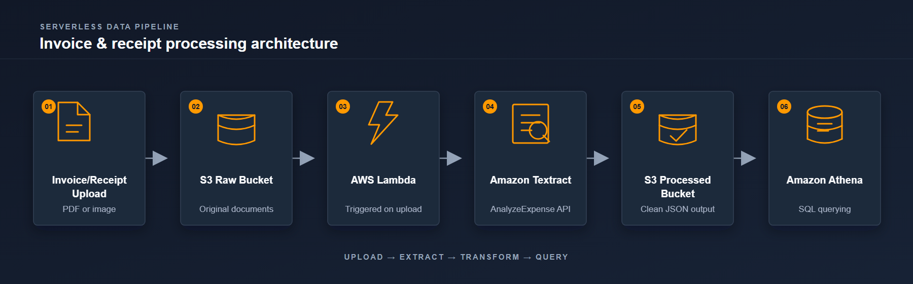

# Automated Invoice & Receipt Processing Pipeline

A serverless ETL pipeline that extracts structured data from invoices and receipts using AWS Textract, eliminating manual data entry for accounts payable workflows.

## Problem
Businesses manually type vendor names, totals, tax, and line items from invoices into spreadsheets or accounting software — slow, error-prone, and still a common pain point for SMBs.

## Architecture


1. Invoice/receipt (PDF/image) uploaded to an S3 raw bucket
2. S3 event triggers an AWS Lambda function
3. Lambda calls Amazon Textract's AnalyzeExpense API
4. Extracted data (vendor, date, total, tax, line items) is formatted into JSON
5. Clean JSON is saved to a processed S3 bucket
6. Amazon Athena enables SQL querying across all processed invoices

## Tech Stack
- **AWS S3** — storage for raw and processed documents
- **AWS Lambda** (Python 3.12) — event-driven processing
- **Amazon Textract** — document AI for expense extraction
- **Amazon Athena** — SQL querying over processed data
- **Terraform** — infrastructure as code
- **GitHub Actions** — CI/CD pipeline for automated deployment

## Infrastructure as Code
This project is fully deployable via Terraform (`/docs/Terraform`). Every push to `main` automatically runs `terraform plan` and `apply` via GitHub Actions, ensuring the deployed infrastructure always matches the codebase.

## Security
- IAM roles follow least-privilege principles (Lambda can only access its specific S3 buckets and Textract's AnalyzeExpense action)
- No credentials are hardcoded — AWS access is managed via IAM and GitHub Secrets
- S3 buckets have public access blocked by default

## Cost
Built entirely within AWS Free Tier limits:
- S3: free tier covers standard usage for this project
- Lambda: 1M free requests/month
- Textract: free tier includes 1,000 pages/month for the first 3 months
- Estimated cost for portfolio/demo use: **$0**

## What I'd add for production scale
- Retry logic and dead-letter queue for failed Textract calls
- Human-review queue for low-confidence extractions
- CloudWatch dashboards for pipeline health monitoring
- Multi-region redundancy for high availability

## Status
Core pipeline built and deployed via both manual setup and Terraform. Currently pending AWS account-level Textract service activation before end-to-end testing can be completed.

## Current Status & Validation

The core serverless pipeline has been implemented and deployed using AWS S3, Lambda, Textract, Athena, Terraform, and GitHub Actions.

### Successfully Implemented

* S3 raw and processed buckets
* S3 → Lambda event trigger
* Lambda invoice-processing logic
* IAM least-privilege permissions
* Terraform infrastructure
* GitHub Actions CI/CD
* CloudWatch logging and monitoring
* Processed JSON structure for downstream Athena analysis

### Current Limitation

The AWS account is currently on the Free account plan, and Amazon Textract is returning:

```text
SubscriptionRequiredException:
The AWS Access Key Id needs a subscription for the service
```

Lambda successfully reaches the Textract `AnalyzeExpense` API, but the AWS account currently does not have the required service access to complete the request.

This is an AWS account-level service-access limitation and not a Lambda code or S3 trigger failure.

Until Textract access is available, the downstream S3 processed-data and Athena components can be validated using a sample structured JSON file.

### End-to-End Target Flow

```text
Invoice / Receipt
       ↓
S3 Raw Bucket
       ↓
AWS Lambda
       ↓
Amazon Textract
       ↓
Structured JSON
       ↓
S3 Processed Bucket
       ↓
Amazon Athena
       ↓
SQL Invoice Analytics
```

**Project Status: Core implementation complete — Textract account access pending.** Once Textract access is granted, the pipeline can be fully validated with end-to-end testing.

c:\Projects\invoice-processing-pipeline-aws\Screenshot 2026-09-15 205545.png