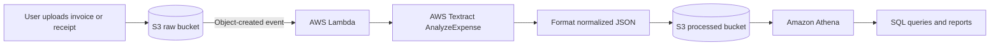

# Architecture

## Overview
The pipeline separates original documents from extracted records. An upload to the raw S3 bucket invokes AWS Lambda, which calls AWS Textract's `AnalyzeExpense` API, formats the response as JSON, and writes the result to a processed S3 bucket. Amazon Athena queries the processed data for reporting and validation.

## Data Flow



1. A user uploads an invoice or receipt to the raw S3 bucket.
2. S3 publishes an object-created event to the Lambda function.
3. Lambda reads the object location and submits the document to Textract `AnalyzeExpense`.
4. Lambda converts the Textract response into a consistent JSON document.
5. Lambda writes the JSON result to a key in the processed S3 bucket.
6. Athena queries the processed objects using an external table or compatible schema.

## Repository Structure

```text
.
├── docs/
│   ├── Architecture.md
│   ├── Design.md
│   ├── Phases.md
│   ├── PRD.md
│   └── Rules.md
├── infra/                 # Terraform configuration (Phase 5)
├── src/
│   └── lambda_function.py # Lambda entry point and orchestration
├── tests/                 # Unit tests for parsing and handlers
├── requirements.txt       # Runtime dependencies, if needed
└── README.md
```

`Memory.md` will be added in Phase 2 when Lambda implementation begins.

## Tech Stack
- **Runtime:** Python 3.12
- **Compute:** AWS Lambda
- **Storage:** Amazon S3 raw and processed buckets
- **Document analysis:** AWS Textract `AnalyzeExpense` API
- **Querying:** Amazon Athena
- **AWS SDK:** boto3
- **Infrastructure:** Terraform
- **CI/CD:** Repository-hosted CI pipeline, such as GitHub Actions
- **Observability:** Amazon CloudWatch Logs and metrics
